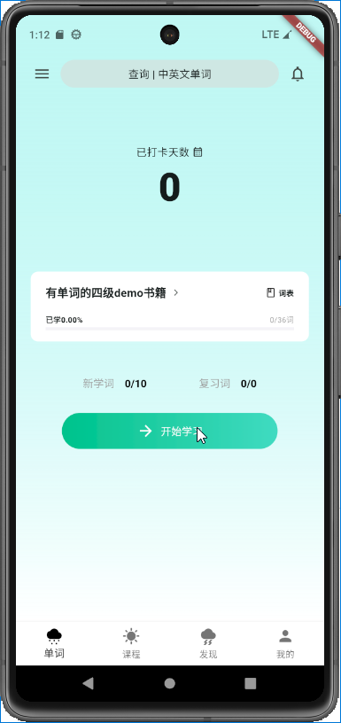
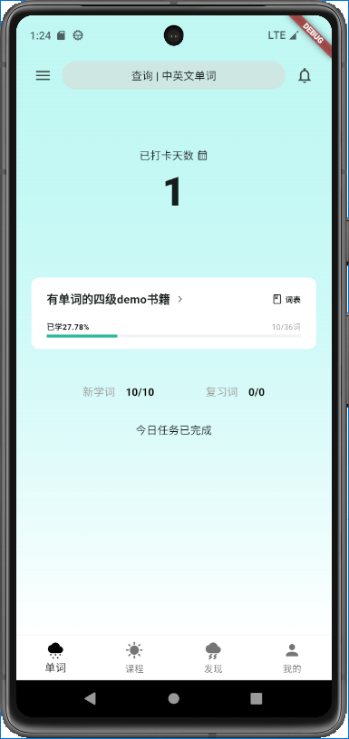

# flutter_shanbei

基于**flutter 框架**仿制的简易扇贝移动端 App

**本项目及其代码仅用作学习和研究.**

Web 版基于 React 开发, 代码开源地址:  
后端代码基于 nestjs.

### 1. 该项目用到以下包或插件

#### getX

介绍: 有很多功能的包,如: 路由跳转,UI 状态管理, 依赖注入(由 getx 管理和提供示例),国际化,主体切换,一些验证工具等

在本项目主要作用:

- 生命周期管理,依赖注入
- 响应式编程 ui 状态管理
- 路由跳转
- Api 请求

  说明:api 模块基于 GetConnect 类, 不好用,**有不少坑**,比如说:不管是 api 错误还是连接错误 还是什么错误,该类统一返回的空响应体,即 res.body 始终为空, 但是有时后端 api,会在响应体中发送一些信息,这样就被覆盖掉了. 亦或者是 连接错误, 本来应该提示用户网络连接有问题. 超时不提示等等.个人建议换成其他 api 库,如:dio?

#### JsonToModel 代码生成

介绍: 由下述的多个包搭配使用, 用户只需编写好 model, 即可自动生成相关的序列化代码和不可变类.

- build_runner 生成插件
- freezed 不可变类生成
- freezed_annotation 不可变类注解(必须搭配上述)
- json_serializable json 序列化生成
- json_annotation json 序列化注解(必须搭配上述)

#### 其他包

- font_awesome_flutter: 添加更多 flutter 没有的图标
- get_storage: 本地持久化 + 内存数据库

  介绍:优先从内存数据库中读数据,没有再去持久存储中读取, 写也是一样, 自动写入内存,后续持久化存储.

- video_player: 视频播放

### 2. 功能

该项目主要完成的是: 单词学习的基础流程逻辑,其中大致功能如下:

- 基础登录注册
- 按照书籍类别查找服务器书籍
- 用户添加书籍到书库中
- 用户删除不需要的书籍(切换逻辑未开发:由于其他测试的书籍单词为 0,切换后整体逻辑有问题)
- 设置功能(纯 ui,无逻辑)
- 每日首次登录时, 请求新的学习计划,学习记录
- 请求一轮单词学习(默认一轮 7 个)
- 学习单词时,自动获取该单词对应笔记
- 在单词笔记页面,用户可以添加自己笔记
- 一轮单词学习完毕后进入小结页面
- 学习完/中途退出,提交当前学习数据
- 完成今日任务后打卡

#### 大致实现效果图

##### 基础登录注册

##### 添加管理书籍

##### 单词学习及其笔记

##### 每轮单词学完后的单词小结

##### 设置页面,纯 ui

